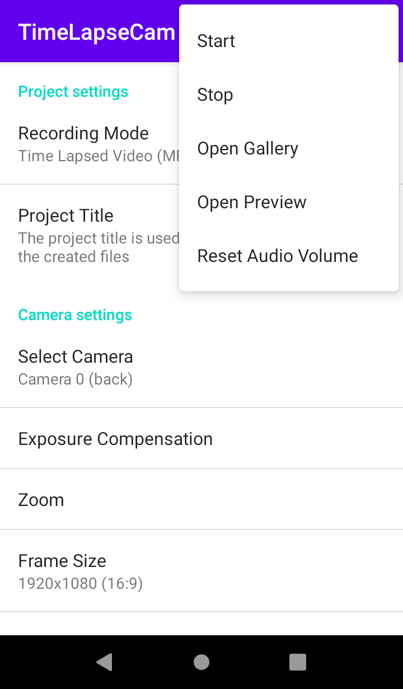

<pre>Send a coffee to woheller69@t-online.de 
</pre>

TimeLapseCam
========================

Minimalistic android app that records time lapse videos in the background
with the screen turned off. Time lapse videos can be saved in various resolutions
as a MP4 video file, or as individual JPEG files. If possible the shutter sound
of the camera is muted, so it can be used as a spy camera. While recording
there is no preview visible and the screen can be turned off.
There is no recording limit, but the app will stop recording if battery
level or disk space is low.

## Features

* Record normal video (MP4)
* Record time lapse video (MP4/JPEG)
* Select various resolutions
* Select camera to use
* Schedule recording on specific date
* Preview with selected resolution
* Disable shutter sound

## License

Forked from  <a href='https://github.com/zeitgeist87/SpartanTimeLapseRecorder'>zeitgeist87/SpartanTimeLapseRecorder</a> which is published under GPL 3.0

## Try my other apps

| **RadarWeather** | **Gas Prices** | **Smart Eggtimer** | 
|:---:|:---:|:---:|
| |  |  |
| **Level** | **hEARtest** | **GPS Cockpit** |
|  |  |  |
| **Audio Analyzer** | **LavSeeker** | **TimeLapseCam** |
|  | |  |
